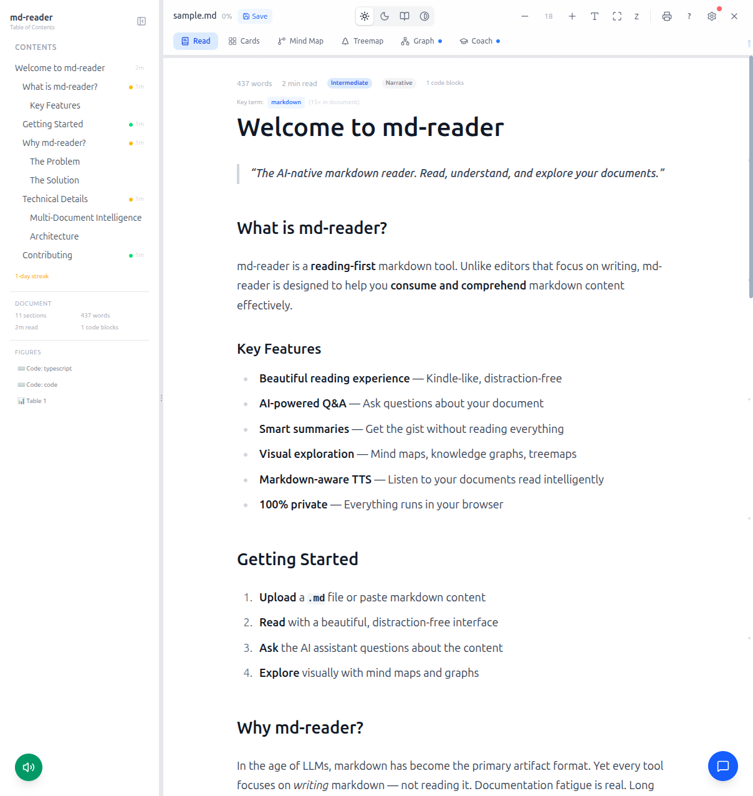
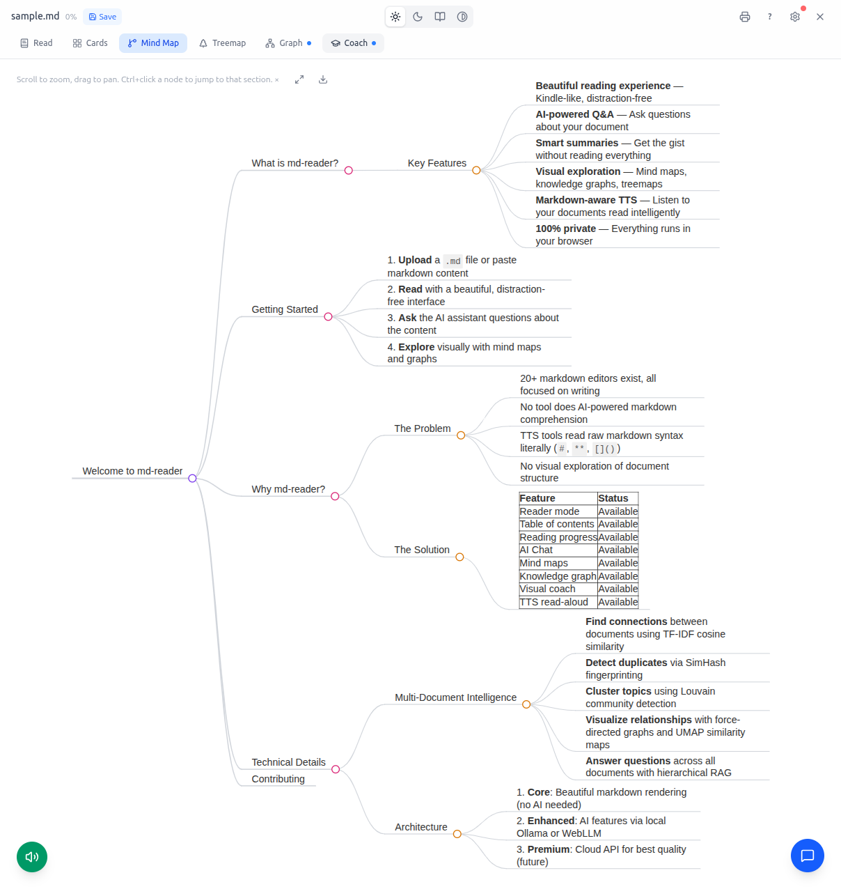

[](https://github.com/manup-dev/themarkdownreader/actions/workflows/ci.yml)
[](LICENSE)
[](https://nodejs.org/)

# md-reader
export type first = {second}
> The AI-native markdown reader. Read, understand, and explore your documents.



**md-reader** is the first markdown tool built for **reading**, not writing. Upload any `.md` file and instantly get a beautiful reading experience with mind maps, AI-powered Q&A, visual exploration, and text-to-speech — all running locally in your browser.

## Prerequisites

- **Node.js >= 20** ([download](https://nodejs.org/))
- **Docker** (optional, for GPU-accelerated AI via Ollama)

## Features

### Reading Experience
- **Beautiful reader** with 4 themes (light, dark, sepia, high-contrast WCAG AAA)
- **Auto-generated TOC** with section reading times, bookmarks, and active section tracking
- **Segmented progress bar** showing reading position per section
- **Focus mode** (`f`) and **Zen mode** (`Z`) for distraction-free reading
- **Resume reading** — automatically picks up where you left off
- **Difficulty badge** — Beginner/Intermediate/Advanced/Expert per document
- **Live WPM counter** — see your reading speed in real-time
- **Estimated finish time** — "~3 min left (2:45 PM)"
- **Confetti celebration** when you finish reading a document
- **Reading streak** — tracks consecutive days of reading
- **Dyslexia-friendly font** toggle for accessible reading

### Visual Exploration



- **Interactive mind map** from heading hierarchy (download as PNG, Ctrl+click to navigate)
- **Treemap** showing relative section sizes with dynamic text contrast
- **Knowledge graph** — AI-extracted concepts with deterministic fallback
- **Summary cards** — expandable section overview with AI summaries

### AI-Powered Understanding


- **Chat Q&A** — ask questions with streamed markdown responses + follow-up suggestions
- **Chat export** — download entire Q&A session as markdown
- **Visual coach** — AI explains sections with analogies, comprehension quizzes with mastery tracking
- **Selection menu** — select text to explain, simplify (ELI5), visualize as diagram, define, cite, highlight, copy
- **"Jump to section" badges** — AI responses link to mentioned document sections
- **3 AI backends**: OpenRouter (cloud, free), Ollama (local GPU), WebLLM (browser)
- **AI status indicator** — colored dot shows which backend is active

### Text-to-Speech
- **Teacher-like narration** — announces headings, describes code blocks, reads lists naturally
- **Speed presets** (0.75x-2x) with WPM tooltips and time remaining
- **Section title display** — see which section is being read aloud

### Multi-Document Library
- **Upload multiple files** — indexed with BM25 full-text search
- **Cross-document Q&A** — ask questions across all your documents
- **Document graph** — visualize relationships between documents
- **Correlation view** — find shared terms between documents
- **Similarity map** — cluster documents by topic (Louvain + UMAP)
- **Collection reader** — connected reading with link discovery and reading order
- **Reading queue** — bookmark docs for later with total time estimates
- **Sort & filter** — by name, size, or date with preview tooltips
- **Duplicate detection** — SimHash fingerprinting catches near-duplicates
- **Export/import** library as JSON backup

### Comments & Annotations
- **Inline comments** — select text, add comments with author names
- **Comments panel** — view, resolve, export, and jump to all comments
- **5-color highlights** with notes and export as markdown
- **Glossary** — auto-detect and define terms from your highlights

### Power User Features
- **Command palette** (`Ctrl+K`) — switch views, toggle theme, print, all in one
- **Vim navigation** — `j`/`k` sections, `gg` top, `G` bottom
- **Bionic reading** (`b`) — bold first half of words for faster scanning
- **Word heatmap** (`h`) — visualize word frequency with color intensity
- **TL;DR mode** (`d`) — collapse to headings only, click to expand
- **Quick glance** (hold `Space`) — preview next section without scrolling
- **Print/PDF export** — `p` key or toolbar button with clean print stylesheet
- **Section difficulty badges** — green/amber/red dots in TOC showing content density
- **Reading speed calibration** — personalized time estimates based on your WPM
- **Code blocks** — language labels, syntax highlighting, one-click copy
- **VS Code extension** — read markdown inside your editor with CodeLens, Outline, sync scroll
- **GitHub extension** — one-click "Open in md-reader" on any GitHub `.md` file

### Keyboard Shortcuts
| Key | Action |
|-----|--------|
| `j` / `k` | Next / previous section |
| `f` | Toggle focus mode |
| `Z` | Toggle zen mode (ultra-minimal) |
| `p` | Print / Export PDF |
| `t` | Cycle theme |
| `?` | Show all keyboard shortcuts |
| `gg` | Jump to top (double-tap g) |
| `G` | Jump to bottom (Shift+G) |
| `Ctrl+K` | Command palette / search |
| `Ctrl+1-4` | Switch view (Read / Mind Map / Cards / Treemap) |
| `Ctrl+Shift+F` | Toggle focus mode |
| `1-4` | Select quiz answer in Coach mode |
| `Esc` | Close panel / exit mode |
| `b` | Bionic reading (bold first half of words) |
| `h` | Word frequency heatmap |
| `d` | TL;DR mode (headings only) |
| `s` | Auto-scroll |
| `Space` (hold) | Quick glance at next section |
| `Ctrl+V` | Paste markdown to open (on upload screen) |

## Quick Start

```bash
git clone https://github.com/manup-dev/themarkdownreader.git
cd md-reader
```

### Option A: With local AI (recommended — Docker + GPU)

If you have Docker and an NVIDIA GPU:

```bash
./startup.sh
```

This starts both the app and Ollama with GPU acceleration. Open http://localhost:5183 — AI features work immediately.

> Ollama auto-pulls `qwen2.5:1.5b` (~1GB). The app is at port 5183, Ollama at 11435.

### Option B: Without Docker (cloud AI)

```bash
npm install
npm run dev
```

Open http://localhost:5183, then configure an AI backend:

1. Click the **gear icon** (top-right) to open AI Settings
2. Get a free API key from [OpenRouter](https://openrouter.ai/keys)
3. Paste it and click **Test** to verify


> Without an AI key, the reader, mind maps, treemap, and TTS still work — only Chat, Coach, and Knowledge Graph need AI.

### VS Code Extension

Use md-reader directly inside VS Code — open any `.md` file and read it with mind maps, TTS, and all visualizations.

```bash
cd vscode-extension
npm install
npm run build
```
Then in VS Code: `Ctrl+Shift+P` → **"Install from VSIX"** → select `vscode-extension/md-reader-0.1.0.vsix`

Or install from source:
```bash
cd vscode-extension && npx @vscode/vsce package --no-dependencies
code --install-extension md-reader-0.1.0.vsix
```

**Usage:** Open any `.md` file → press `Ctrl+Shift+R` (or click the book icon in the editor title bar)

**VS Code features:**
- Reading time CodeLens on headings
- Outline view with section word counts
- Hover preview for markdown links
- Sync scroll between editor and reader
- Session summary on close
- Status bar reading progress

### GitHub Browser Extension

Read any markdown file on GitHub with the full md-reader experience — mind maps, AI chat, highlights, and more.

```bash
# Chrome / Edge / Brave
1. Open chrome://extensions (or edge://extensions)
2. Enable "Developer mode" (toggle in top-right)
3. Click "Load unpacked"
4. Select the browser-extension/ folder from this repo
```

**Usage:** Navigate to any `.md` file on GitHub → click **"Open in md-reader"** in the file toolbar.

By default it opens the hosted version. To use your local dev server instead, click the extension icon and set the URL to `http://localhost:5183`.

### Development

```bash
npm run dev          # Vite dev server (port 5183)
npm run test         # Unit tests (vitest)
npm run eval         # AI accuracy benchmark (15 tests, ~95/100)
npm run typecheck    # TypeScript check
npm run build        # Production build
npm run lint         # ESLint
```

## Tech Stack

| Layer | Technology |
|-------|-----------|
| Frontend | React 19 + Tailwind CSS 4 |
| Markdown | unified / remark ecosystem (GFM + math) |
| Visualization | Markmap, D3.js, Cytoscape.js |
| AI (cloud) | OpenRouter (free models) |
| AI (local) | Ollama + qwen2.5:1.5b (GPU) |
| AI (browser) | WebLLM (WebGPU) |
| Search | MiniSearch (BM25), TF-IDF cosine similarity |
| Storage | IndexedDB via Dexie.js |
| TTS | Web Speech API |
| State | Zustand (with devtools) |

## Project Structure

```
src/
├── components/            # React components
│   ├── Reader.tsx         # Reading view (4 themes, WPM, progress, footnotes)
│   ├── MindMap.tsx        # Interactive mind map (depth control, sync highlight)
│   ├── TreemapView.tsx    # D3 treemap with dynamic contrast
│   ├── Chat.tsx           # AI Q&A (streaming, follow-ups, section badges)
│   ├── Coach.tsx          # Visual coach + quiz + mastery tracking
│   ├── CommentsPanel.tsx  # Document annotations & comments
│   ├── KnowledgeGraph.tsx # AI concept graph + deterministic fallback
│   ├── SummaryCards.tsx   # Expandable section cards
│   ├── TtsPlayer.tsx      # Teacher-like TTS with section titles
│   ├── SelectionMenu.tsx  # Text selection (ELI5, cite, highlight, comment)
│   ├── SearchOverlay.tsx  # Search + command palette (Ctrl+K)
│   ├── Workspace.tsx      # Multi-doc library (sort, queue, graph)
│   └── ...
├── lib/
│   ├── ai.ts              # 3-backend AI (OpenRouter/Ollama/WebLLM, streaming)
│   ├── prompts.ts         # AI prompt templates (optimized for 1.5B models)
│   ├── markdown.ts        # Parsing, chunking (800-char cap), TOC, stats
│   ├── docstore.ts        # IndexedDB with SimHash, TF-IDF, BM25, comments
│   ├── telemetry.ts       # Optional anonymous usage analytics (opt-in)
│   └── ...
├── store/useStore.ts      # Zustand state (devtools in dev mode)
└── test/                  # Vitest unit tests

vscode-extension/          # VS Code extension
├── src/extension.ts       # Commands, CodeLens, Outline, hover, sync scroll
├── src/ReaderPanel.ts     # Webview panel management
└── webview/               # React webview (shares main app components)

browser-extension/         # Chrome/Edge extension for GitHub
├── manifest.json          # Manifest V3
├── content.js             # Injects "Open in md-reader" on GitHub .md files
└── popup.html             # Extension popup with settings

scripts/eval/              # AI accuracy benchmark system
├── runner.ts              # Eval harness (15 tests, 96/100 avg)
├── ground-truth.json      # Expected outputs
├── test-corpus/           # 5 test markdown files
└── results.tsv            # Experiment log
```

## Eval System (Karpathy Loop)

md-reader uses a systematic eval loop for AI quality:

```bash
npm run eval  # Runs 15 tests, reports score out of 100
```

| Feature | Tests | Best Score |
|---------|-------|-----------|
| TOC extraction | 2 | 100/100 |
| Document stats | 2 | 100/100 |
| AI summarization | 2 | ~87/100 |
| AI Q&A | 2 | 100/100 |
| Knowledge graph | 1 | 90/100 |
| Collection links | 1 | 100/100 |
| Cross-doc Q&A | 1 | 100/100 |
| Mind map structure | 2 | 100/100 |
| TTS narration | 1 | 100/100 |
| Coach explanation | 1 | ~80/100 |

## Claude Code Integration (MCP)

md-reader can serve as a visual companion for Claude Code. Claude reasons about your docs; md-reader visualizes them.

### Setup

1. Start the dev server: `npm run dev`
2. Install MCP server dependencies: `cd mcp-server && npm install`
3. Add to your Claude Code MCP config (`.claude/settings.json`):

```json
{
  "mcpServers": {
    "md-reader": {
      "command": "npx",
      "args": ["tsx", "mcp-server/index.ts"],
      "cwd": "/path/to/md-reader"
    }
  }
}
```

### Available Tools

| Tool | Description |
|------|-------------|
| `show_mind_map` | Interactive mind map of a markdown file |
| `show_knowledge_graph` | Force-directed concept network |
| `show_treemap` | Section-size proportional treemap |
| `read_aloud` | Text-to-speech narration |
| `show_coach` | AI coach with explanations + quizzes |

### Example

Ask Claude: *"Show me a mind map of docs/architecture.md"* — Claude invokes the tool and your browser opens the interactive visualization.

## License

MIT

## Contributing

Contributions welcome! See [CONTRIBUTING.md](CONTRIBUTING.md) for setup and guidelines.

---

*Built with 220+ features across 11 rounds of systematic polish. Available as a web app, VS Code extension, and GitHub browser extension.*
