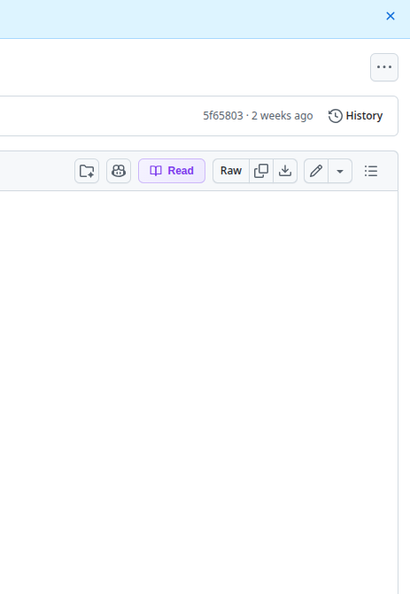

# md-reader Browser Extension

Read GitHub markdown files beautifully with mind maps, AI chat, TTS, and visual exploration.

## How It Works

The extension adds a **Read** button right next to GitHub's **Raw** button on any `.md` file:

Click **Read** and the markdown opens instantly in md-reader with full AI-powered features.

> **Note:** If you don't see the Read button, refresh the page (Cmd+R / Ctrl+R). GitHub's SPA navigation sometimes loads the toolbar after the extension runs. The button should appear within a few seconds on most pages.

## Install (Chrome / Edge)

1. Clone or download this repository
2. Go to `chrome://extensions` (or `edge://extensions`)
3. Enable **Developer mode** (toggle in top-right)
4. Click **Load unpacked** and select this `browser-extension/` folder
5. Navigate to any `.md` file on GitHub and look for the **Read** button

## What You Get

When you click Read on any GitHub markdown file:

- Beautiful Kindle-like reading view with 4 themes (light, dark, sepia, high-contrast)
- Interactive mind map of document structure
- AI-powered Q&A and summarization (runs locally via Ollama or in-browser via WebLLM)
- Text-to-speech with markdown-aware narration
- Knowledge graph showing concept relationships
- Section-by-section AI coach with quizzes
- Comments, highlights, and bookmarks
- Reading progress tracking

**100% private** — your files never leave your browser.

## Alternative: Extension Popup

You can also click the md-reader extension icon in your toolbar and press **"Open Current File"** to send the current page to md-reader.

## Configuration

Click the extension icon to set a custom md-reader URL (e.g., `http://localhost:5183` for local development). By default it uses the hosted version.
