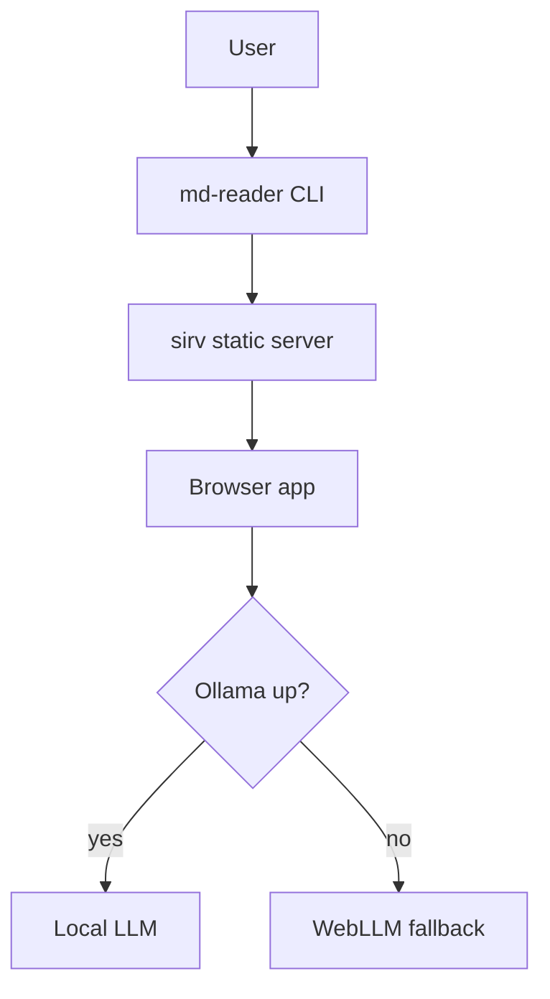
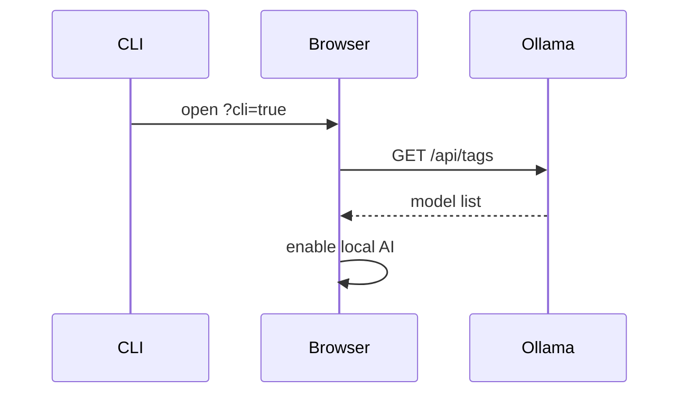
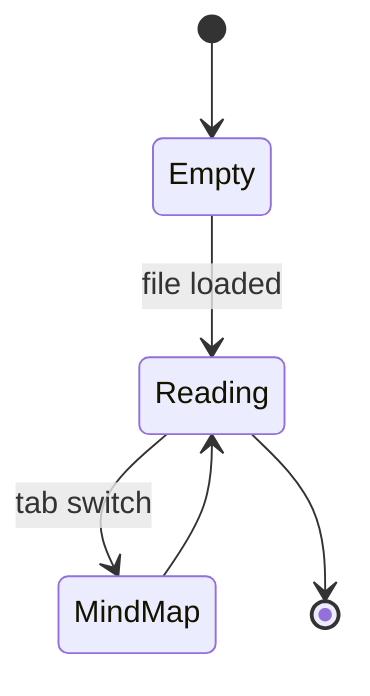

# Harness Overview

A representative architecture doc used by the e2e suite to verify mermaid rendering.

## Request flow

## Handshake

## Reader states

Three diagrams above; the harness spec asserts each becomes a non-zero SVG.
